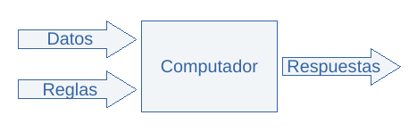

```{r, echo=FALSE}
htmltools::img(src = knitr::image_uri("logo_horizontal_azul.jpg"), 
               alt = 'logo',
               width = '200',
               height = '80',
               style = 'float:top')
```
---
## Proceso de Ciencia de datos

El termino "ciencia de datos" se utiliza para referirse a un conjunto de metodologías y herramientas cuyo objetivo es descubrir información valiosa y desarrollar herramientas y aplicaciones haciendo uso del creciente volumen de datos disponibles actualmente. El proceso puede dividirse según lo mostrado en el siguiente gráfico:


La flecha, ademas de indicar un aumento en la "sofisticación" de las herramientas y algoritmos usados, también indica la dirección en la que desarrolla un proyecto de ciencia de datos.

## Recolección y procesamiento

Se tienen dos elementos principales:

* Datos Crudos: Los cuales pueden provenir del sistema de control, bases de datos históricas, información de operadores, procedimientos, ingenierías, departamento de mantenimiento, etc.
* Procesamiento de datos: Algoritmos para dar manejo a:
  + Tipos de datos y unidades de Ingeniería
  + Datos Malos/ Datos Incompletos
  + Uniformidad del muestreo
  + Identificación de "Outliers"
  
De lo cual se obtienen *Datos Procesados*

### Objetivos y proposito

Los objetivos de esta fase son:

* Estructurar los datos para ser usados
* Conocer o desarrollar modelos teóricos
* Conocer las expectativas del funcionamiento del sistema
* Entender los problemas y/o los intereses referentes al sistema

## Analisis exploratorio

Durante la fase de análisis exploratorio se estudian los datos recopilados y procesados para determinar:

* Características de las señales del sistema
  + Tendencias
  + Ciclos
  + Ruido
* Revisión Preliminar de relaciones entre señales

### Objetivos y proposito

* Evaluar los datos disponibles
* Elaborar hipótesis iniciales acerca del sistema estudiado

## Inferencia

Se enfoca en el desarrollo de *modelos* explicativos, principalmente se ocupa de:

* Desarrollar regresiones lineales y no lineales
* Verificar correlaciones estadísticas entre variables
* Determinar la influencia de variables de entrada en el comportamiento de variables de salida
* Explicar de forma comprensible el funcionamiento del sistema estudiado

### Objetivos y proposito

Durante la fase de inferencia se busca desarrollar *modelos* explicativos, no siempre acertados desde el punto de vista cuantitativo, pero si desde el punto de vista cualitativo.

Es el punto inicial de apoyo para la toma de decisiones, responde a preguntas como:

* Existe una relación entre la entrada X y la salida Y?
* Qué tan fuerte es esta relación?
* Cual es la relación mas importante entre las entradas y la salida del sistema?
* Qué tan grande es el efecto de un cambio en cada una de las entradas sobre la salida?
* Son lineales las relaciones entre las entradas y la salida?
* Existe sinergia (la actuación en conjunto de varias influencias producen un efecto superior al de la suma de las influencias estudiadas individualmente) entre variables del sistema?

## Aprendizaje Automatico (ML)

* Aplicación de distintos algoritmos de *Machine Learning (ML)* en español: aprendizaje automático.
  + Arboles
  + Random Forest
  + SVM
  + Boosting
* Aplicación de redes neuronales y *Deep Learning*

### Objetivos y proposito

El objetivo es el desarrollo de *modelos* predictivos a ser aplicados para:

* Automatización de procesos
* Sistemas de apoyo y recomendación
* Sistemas de entrenamiento de operadores
* Sistemas de mantenimiento predictivo
* Gemelos digitales

## Paradigmas de programación

En la metodología de ciencia de datos el paradigma de programación cambia:



En el paradigma clásico, se conocen unas reglas (modelo), las cuales definen el comportamiento de un sistema, dichas reglas son programadas en el computador de manera que, cuando introducimos nuevos datos de entrada, el computador toma los datos, les aplica las reglas (o modela el comportamiento del sistema) y finalmente se obtienen unos resultados (salidas)


En el paradigma de ciencia de datos, se conocen unos datos de entrada y unos resultados (esta dupla son en realidad ejemplos de como funciona el sistema), en el computador se programan algoritmos con los que "aprende" las reglas implícitas dado el comportamiento del sistema real. Al final del proceso, el computador es una replica del sistema real y se comporta de manera similar.

Después de finalizada la etapa de "entrenamiento" es posible introducir nuevos datos para obtener respuestas del mismo modo en que se obtendrían respuestas del sistema real, el proceso completo se muestra en la siguiente gráfica:


Hay que tener en cuenta puntos importantes en el paradigma de ciencia de datos:

* La cantidad de ejemplos disponibles es importante, influye en la disminución del error de predicción
* La diversidad de los ejemplos disponibles es importante, aumenta la capacidad de aprender sobre todas las condiciones posibles del sistema
* La calidad de los ejemplos disponibles es importante, permite al computador aprender el comportamiento correctamente.

### Ejemplo

Supongamos que se desea desarrollar un sistema de recomendación para la elaboración de hojas de datos de transmisores de presión, definamos algunos parámetros del proyecto:

**Sistema a imitar**: Ingeniero de Instrumentación

**Ejemplos de entrenamiento**: Hojas de datos de transmisores de presión con:

* Datos de entrada:
  + Presión
  + Temperatura
  + Estado del fluido
  + Viscosidad
  + Corrosividad
  + Tendencia a pegarse (built-up)
  + Pulsación
  + Condensación
  + Aplicación (presión manométrica, absoluta, diferencial, nivel, flujo)
  + etc
* Datos de salida: Características técnicas especificadas

**Reglas**: Conceptos técnicos para la correcta especificación de un transmisor de presión, según los datos de entrada.

**Objetivo**: Entrenar un sistema que este en capacidad de dar buenas recomendaciones en el proceso de especificación de transmisores de presión.

## Inferencia versus ML

Ambos están estrechamente relacionados con el paradigma de ciencia de datos, ambos tratan de imitar un sistema usando ejemplos para determinar las "reglas" que gobiernan este. Se diferencian en:

**Inferencia**

* Asume una estructura particular para imitar al sistema: $Y = aX+b$, las reglas tienen una forma predeterminada
* Permite establecer relaciones que son fáciles de entender y explicar
* Usa herramientas estadísticas y de inferencia (pruebas de hipótesis) a las preguntas planteadas sobre el sistema.

**Machine Learning**

* No requiere asumir ninguna estructura para imitar al sistema, las reglas se determinan directamente de los ejemplos y pueden ser muy complicadas
* Las relaciones no son accesibles directamente, no son fáciles de explicar
* Genera modelos (reglas) que permiten imitar de forma mas precisa el comportamiento del sistema real en comparación con las herramientas disponibles con la inferencia

## Ciclo de los proyectos de ciencia de datos

El proceso de ciencia de datos es iterativo, cada fase tiene un propósito definido, pero se puede volver a una fase anterior dependiendo del desarrollo de una fase posterior.


En la ciencia de datos los modelos pueden refinarse indefinidamente, pero es imposible superar ciertas brechas en la predicción, podemos acércanos asintoticamente a dicho limite pero no superarlo.

## Empresas o Firmas direccionadas por datos

Son aquellas que se apoyan en la ciencia de datos para tomar decisiones en complemento con las opiniones de sus expertos. En general pueden usar la ciencia de datos para:

* Toma de decisiones
* Evaluación y estructuración de objetivos en sus proyectos
* Automatización y mejora de procesos
* Direccionar recursos a proyectos y soluciones mas promisorias
* Establecer alcances que mejoran la probabilidad de éxito y el retorno de la inversión de los proyectos

### Ejemplo

Pensemos en un proceso o una planta que sabemos que es ineficiente, pero para la que no tenemos claro cuales son las causas de la ineficiencia. En donde podríamos usar la ciencia de datos?

* Con un análisis a nivel de inferencia podemos determinar cuales son las variables mas relevantes en el desempeño del sistema y estudiar el efecto que tendría un ajuste en el comportamiento de dichas variables, la información resultante puede usarse para hacer un análisis de pareto y determinar los problemas mas relevantes a resolver, la identificación de las causas debe hacerse siempre con expertos en la materia (conocedores del proceso) hay que entender que el análisis de datos solo permite establecer correlaciones, pero no causalidad.
* La identificación de los problemas ayudan a seleccionar las posibles soluciones, que pueden ser sencillas y económicas, por ejemplo:
  + Operativas
    - Ajustar los procesos operativos
    - Ajustar puntos de operación de algún equipo o proceso
    - Ajustar la sintonización de un lazo
  + Mantenimiento
    - Reparación o mantenimiento de equipos
    - Calibración y mantenimiento de instrumentos
    - Mantenimiento y reparación de actuadores
* Si la solución requiere de la ejecución de un proyecto, es posible desarrollar un modelo con ML (identificación del modelo) que permita:
  + Probar varias estrategias o sintonizaciones que mejoren el desempeño de los lazos de control comprometidos.
  + En casos en los que el control requiera de robustez (disminuir las afectaciones debidos a cambios en la dinámica del sistema o factores externos) se pueden implementar estrategias de control basados en redes neuronales.
* Para el desarrollo de proyectos se pueden considerar el desarrollo de herramientas que faciliten y agilizen el desarrollo de la ingeniería (similar al ejemplo del sistema de recomendación para elaborar hojas de datos de transmisores de presión).
* Una vez concluido el proyecto, en operación de la planta se pueden continuar identificando mejoras operativas y desarrollar herramientas de mantenimiento predictivo, hechas a la medida y a menores costos en comparación con sistemas de monitoreo de condiciones existentes.
* Puede actualizarse el modelo de la planta construida y usar dicho modelo para el entrenamiento de nuevos operadores.

## Qué podemos ofrecer?

West Engineering es el aliado estratégico que su empresa necesita para comenzar a **Transformarse** en una direccionada por datos e información. Podemos estar presentes en todas las etapas del proceso y llegar hasta el desarrollo de aplicaciones especificas de ML.

### Equipo de trabajo


### Herramientas


***

